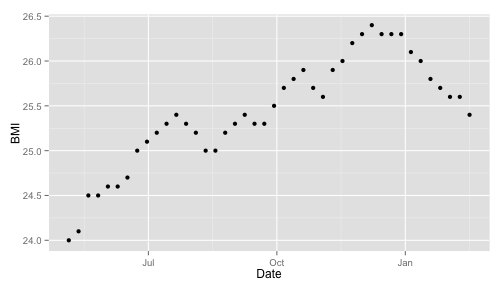

## Body Mass Index Summary

* Body Mass Index (BMI) is a measure of body fat based on height and weight[1,2]
  * Applies to both men and women 

* You can use your BMI to determine if you are underweight, normal weight, overweight or obese
  * Note that the Body Mass Index is only one of many ways to assess your weight
  * If you have concerns about your weight, please be sure to discuss them with your physician
  * This calculator is only a basic tool to help guide you concerning your body weight

References
  * 1. [Body Mass Index](http://en.wikipedia.org/wiki/Body_mass_index), Wikipedia. Retrieved June 23, 2014.
  * 2. [Global Database on Body Mass Index](http://apps.who.int/bmi/index.jsp?introPage=intro_3.html), World Health Organization. Retrieved June 23, 2014.

--- .class #id

# Keep In Touch With Your Weight Using the BMI Calculator App!

* Knowledge is Power!
* The Best Way to Stay in Shape is to Know Where You Stand!
  * Regularly check your BMI using the BMI Calculator
  * Start a Competition with your Friends!
  * Watch your BMI to see if there are times (holidays?) during the year when your BMI tends to rise

---

## BMI Calculation Details

* If you are $x$ feet and $y$ inches tall, then your Total Height in Inches is equal to:

$$total\_height\_in\_inches = x * 12 + y$$

* To calculate your BMI, the following formula is used:

$$BMI = \left[ \frac{ weight\_in\_pounds}{total\_height\_in\_inches^2} \right] * 703.0$$

  * where $weight\_in\_pounds$ is your weight, measured in pounds.

---
## Don't Let Your Weight Rule You!

* You can run the BMI Calculator at the following URL:

https://leskin.shinyapps.io/DDPProject/

* HAVE FUN!

